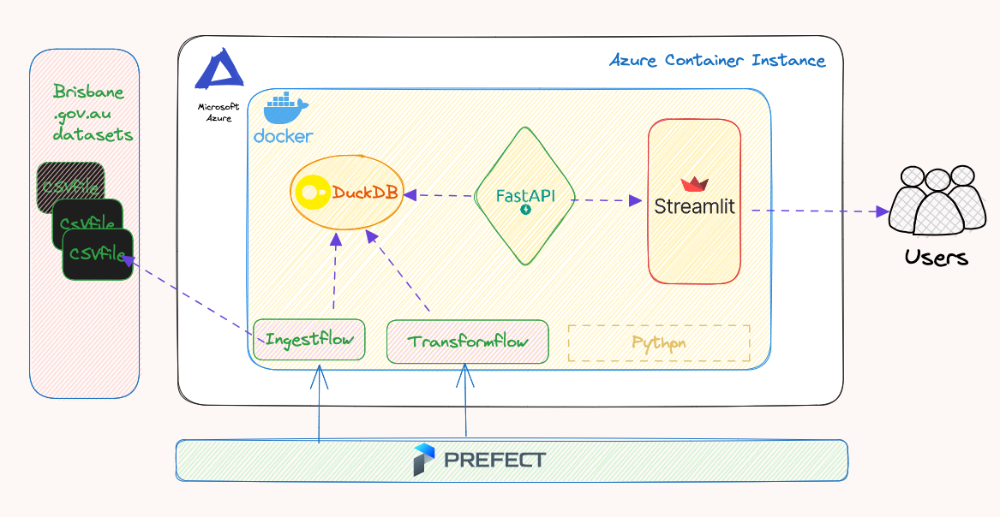
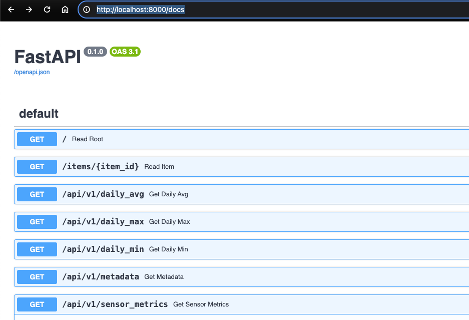
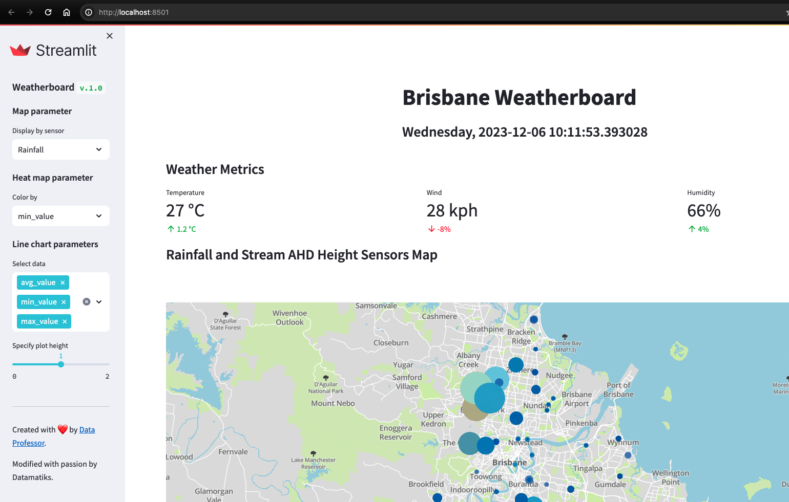
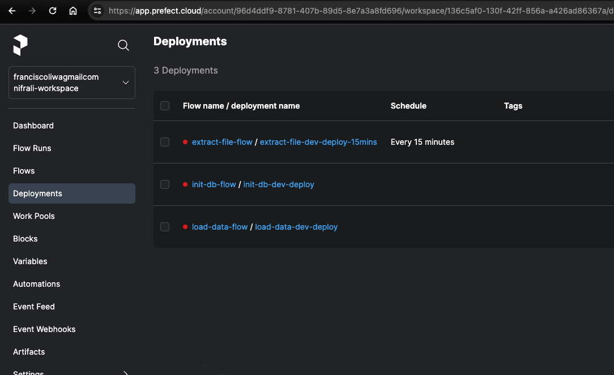

# IoT Platform  Using Modern Data Stack
  This project goal is to create an IoT platform from scratch using Modern Data Stack ( Prefect, DuckDB , FastAPI, Streamlit)

# Pre-requisites

- Prefect Cloud account
- Prefect API URL and Key
- Mapbox Token
- Docker desktop
- [PDM ( Python Dependency Manager )](https://pdm-project.org/latest/)
- [Prefect](https://www.prefect.io/)
- [FastAPI](https://fastapi.tiangolo.com/)
- [Streamlit](https://streamlit.io/)

# How to Run

1. Install pdm

    `$ curl -sSLO https://pdm-project.org/install-pdm.py `

    `$ python3 install-pdm.py [options]`

2. Install dependencies
    
    `$ pdm install`

3. Activate virtual environment

    `$ eval $(pdm venv activate)`

4. Create '.env' variable  inside root directory by renaming .sample-env and then provide your credentials

5. Run docker  from root directory

    `$ docker compose up`

# How To Use

1. API      - http://localhost:8000/docs

    

2. Web UI (Streamlit App)  - http://localhost:8015

    

3. Prefect Cloud UI - https://app.prefect.cloud

    

### Meetup Presentation

[Moder Data Stack PPT](images/meetup-ppt.pdf)